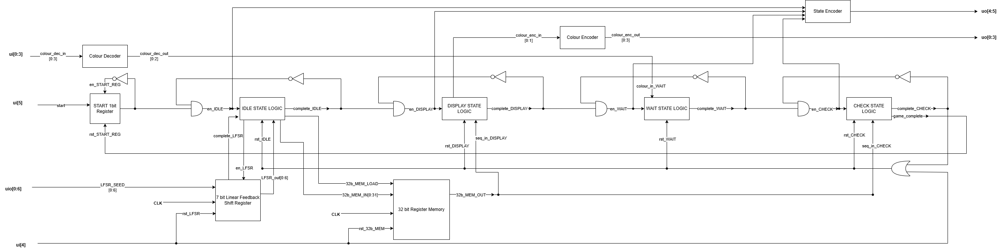
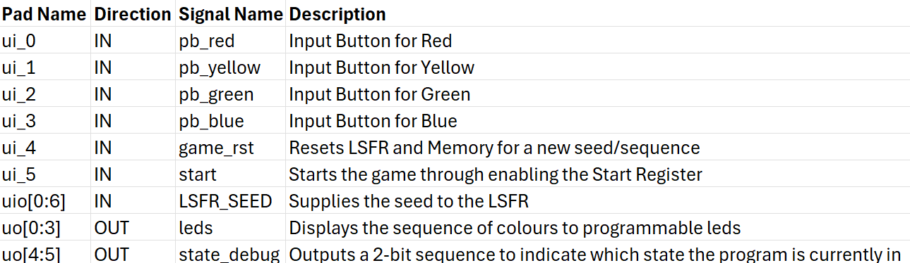
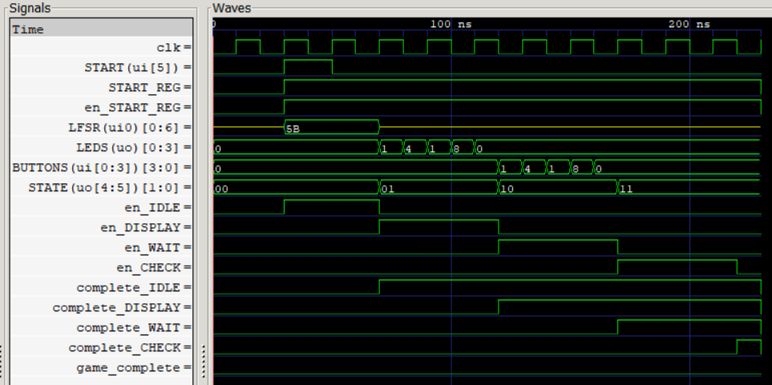

<!---

This file is used to generate your project datasheet. Please fill in the information below and delete any unused
sections.

You can also include images in this folder and reference them in the markdown. Each image must be less than
512 kb in size, and the combined size of all images must be less than 1 MB.
-->

## How it works

This project implements the classic _Simon Says_ game. The design uses digital logic to control game flow through a finite state machine (FSM), and memory elements to store a pseudo-random sequence of color cues. The system interfaces with external buttons and LEDs to allow human interaction and gameplay.

### Game Flow

Upon powering up the chip:

1. **Idle State**

   - Waits for the `start` signal.
   - A 7-bit seed is loaded into the LFSR via a bidirectional bus.
   - A 32-bit pseudo-random sequence is generated by the LFSR.
   - Each color is encoded in 2 bits, allowing 16 rounds (16 × 2 bits = 32 bits).
   - The sequence is stored in a 32-bit register-based memory.

2. **Display State**

   - Displays the current round's color sequence on the LEDs.

3. **Wait State**

   - Waits for user inputs through button presses.

4. **Check State**

   - Verifies the user inputs against the stored color sequence.
   - If correct, advances to the next round and loops back to the Display State.
   - If incorrect, the game ends.

5. **End of Game**
   - Triggered when either the player completes 16 rounds or makes a mistake.
   - Returns to waiting for the `start` signal to begin a new game.

### Key Components

1.  **32-bit Register Memory**

- Stores the color sequence (16 values × 2 bits).

2. **7-bit Linear Feedback Shift Register (LFSR)**

   - Generates a pseudo-random 32-bit sequence.
   - Uses a 7th-order primitive polynomial to ensure maximal length (2⁷ - 1 = 127 values).
   - Special logic ensures the state never becomes all zeros.
   - Seeded externally to vary game sequences across resets and sessions.

3. **Color Encoder/Decoder**

   - Converts 4 individual button signals into a single 2-bit color value for logic comparison (and vice versa).
   - Ensures consistent color encoding across modules.

4. **Finite State Machine (FSM)**

   - Controls game logic and transitions:
     - Idle → Display → Wait → Check → Display (next round) or Game Over
   - Prevents invalid state transitions.

5. **State Encoder**

   - Maps current FSM state to a 2-bit output for debugging.
   - Enables us to monitor game progress externally.

### Block Diagram

### I/O Table

### Timing Diagram

Below shows the expected timing diagram for one loop of the game. It transitions between the IDLE, DISPLAY, WAIT, and CHECK states and then resets for next loop.
 
Note, much of the timing relies on user input so the displayed state durations may not match the lengths during gameplay. A random LFSR Seed of 0x5B is loaded along with a current display sequence of 1, 4, 1, 8 or (0b0001, 0b0100, 0b0001, 0b1000).

## How to test

### Gameplay Functionality

- Simulate a full 16-round win by entering the correct sequence each round — system should complete all rounds and then return to IDLE.
- Enter an incorrect input during, for example, round 5 — system should terminate the game and return to IDLE.
- During each DISPLAY phase, ensure the LEDs light up in the correct order that matches the LFSR-generated sequence.
- Press multiple color buttons simultaneously — system should either reject the input or only register one color.

### Finite State Machine Transitions

- After leaving IDLE, verify the sequence of state transitions:
  - DISPLAY → WAIT → CHECK → (DISPLAY if correct input, IDLE if incorrect input)
- The FSM should correctly:
  - Show the color sequence
  - Wait for the user's button inputs
  - Check the inputs against the stored sequence
  - Advance to the next round if correct, or end the game if incorrect

### Startup and Seeding

- Power on the chip without pressing the start button — system should remain in IDLE.
- Provide a valid 7-bit seed via the bidirectional bus and then press start — FSM should leave IDLE, generate a 32-bit color sequence using the LFSR, and proceed to the DISPLAY state (which can be seen through the state_debug value).
- Apply the same 7-bit seed multiple times — the LFSR should generate the same 32-bit sequence each time.
- Apply different seeds — the generated color sequence should differ each time, confirming LFSR randomness and external seed functionality.

### Reset Handling

- Press reset while in IDLE — system should remain in IDLE and clear any stored sequence or state.
- Press reset during DISPLAY, WAIT, or CHECK — system should reset immediately and return to IDLE, discarding the current game state.
- Hold reset while pressing start — system should not start the game until reset is released.

## External hardware

| Component    | Quantity | Notes                                        |
| ------------ | -------- | -------------------------------------------- |
| Push Buttons | 6        | Red, Blue, Green, Yellow, Start, Reset       |
| LEDs         | 4        | One for each color, with pull-down resistors |
| Raspberry Pi | 1        | Sends 7-bit seed to the chip                 |
